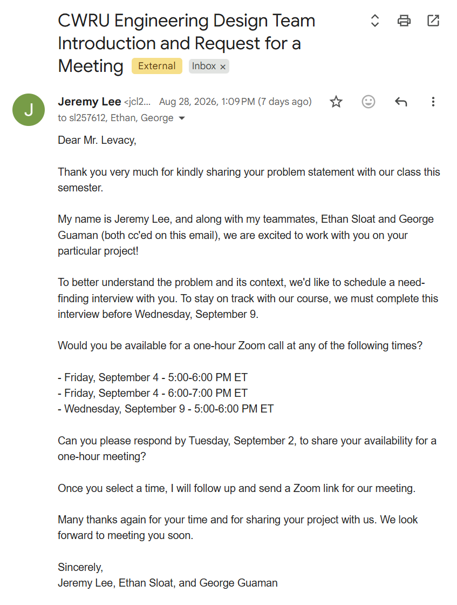

# Week 1 Progress Log - Team 7

### Team 7 Members: Jeremy Lee, George Guaman, Ethan Sloat (myself)
 

__Work undertaken so far:__
- Meet each other and rank topic choices (Wed 8/26)
    - Jeremy was more familiar with the contents of these kits and capabilities of the ESP32, so he conducted an informal feasability review of the different problem statements 
- Exchanged contact information for communication and laid out rough communication guidelines (Wed 8/26)
- Jeremy drafted email to stakeholder after we coordinated schedules, and sent to team for review (Thurs 8/27)
   - Email sent to stakeholder Fri, 8/28 at 1:09 pm
   

- Drafted team contract (Fri 8/28)
    - Focus on clearly defining roles

